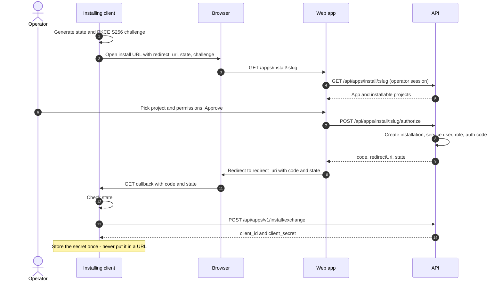
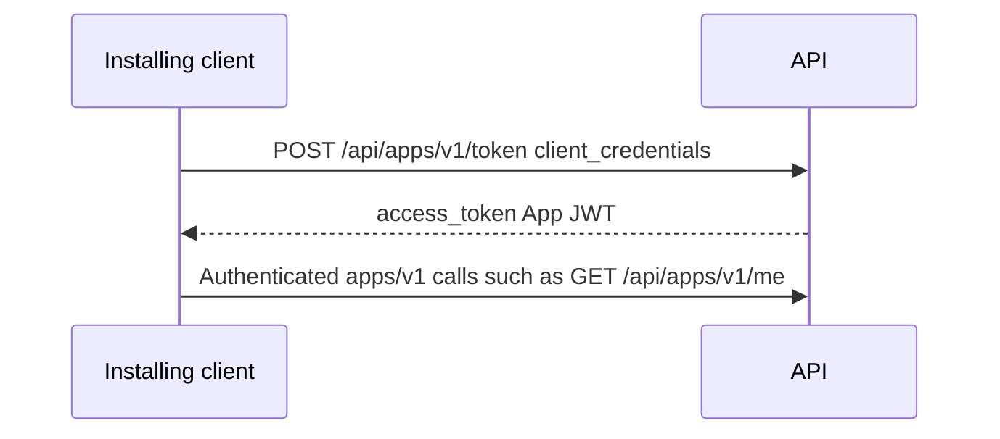

# App install

How an external app (for example Site Crawler) gets project-scoped credentials on Bayes Platform. This is the OAuth-style **install** flow: a human approves in the browser; the installing client receives `client_id` / `client_secret` via a one-time code + PKCE exchange. The secret never appears in a redirect URL.

API paths below assume the private API prefix `/api` (see `apps/api/src/config/api-prefix.ts`).

## Actors

| Actor | Role |
| --- | --- |
| **App manifest** | Platform catalog entry (name, slug, grantable permissions, HTTPS callback allowlist). Created in the backoffice. |
| **Installing client** | The app being installed: CLI (`bayes apps install`) or a deployed app backend (Site Crawler). Owns the PKCE verifier; calls the exchange endpoint. |
| **Operator** | Logged-in human with `app.install`. Opens the install UI, picks a project and permissions, approves. |
| **Web app** | Bayes Connect UI at `/apps/install/:slug`. Loads the install page and posts authorize; then redirects the browser to `redirect_uri`. |
| **API** | Issues the installation + one-time code; exchanges code+verifier for credentials; later issues App JWTs. |
| **Callback endpoint** | Loopback HTTP server (CLI) or HTTPS route on the installing app. Receives `code` + `state` only. |

## Prerequisites

1. An **app manifest** exists (backoffice → Apps), with a stable `slug`.
2. **Grantable permissions** on the manifest are the only permissions the operator can grant at install time.
3. **`redirect_uri` rules**:
   - **Loopback** (no allowlist entry required): `http(s)://localhost`, `*.localhost`, `127.0.0.1`, or `::1`.
   - **Registered**: exact string match on the manifest allowlist, and **https only** (plain `http://app.example.org` is rejected).
4. The operator can sign in and holds `app.install`.
5. The installing client can open a browser (or send the operator a URL) and later call the API for exchange.

## End-to-end workflow

Two surfaces share the same protocol; only `redirect_uri` and who runs the callback differ.



### After install (API access)



## Install URL (browser entry)

Built by the installing client (CLI does this automatically):

```
{FRONTEND}/apps/install/{slug}
  ?redirect_uri={url-encoded callback}
  &state={opaque csrf value}
  &code_challenge={S256 challenge}
  &code_challenge_method=S256
```

| Query param | Who creates it | Purpose |
| --- | --- | --- |
| `redirect_uri` | Client | Where the browser returns after approve/deny. Must pass allowlist / loopback rules. |
| `state` | Client | CSRF; client must reject a callback with a different `state`. |
| `code_challenge` | Client | PKCE S256 challenge (`base64url(sha256(code_verifier))`). |
| `code_challenge_method` | Client | Always `S256`. |

The **verifier stays only on the client**. The web app forwards the challenge into authorize; it never sees the verifier.

## HTTP reference

Paths are relative to the API origin (e.g. `https://connect.example/api`).

### 1. Load install page (operator session)

```
GET /apps/install/:slug
Authorization: Bearer <operator access token>
```

**Permission:** `app.install`.

**Response** `{ data: { app, projects } }` — manifest summary (including `allowedRedirectUris` and `grantablePermissions`) and projects the operator may install onto (backoffice-visible projects).

Contract: `AppsRoutes.getInstall`.

### 2. Authorize install (operator session)

```
POST /apps/install/:slug/authorize
Authorization: Bearer <operator access token>
Content-Type: application/json

{
  "payload": {
    "projectId": "<uuid>",
    "permissions": ["document.read", "..."],
    "redirectUri": "https://app.example.com/auth/bayes/callback",
    "state": "...",
    "codeChallenge": "...",
    "codeChallengeMethod": "S256"
  }
}
```

**Permission:** `app.install`.

**Effects (single transaction):**

- Refuses if an **active** installation already exists for that manifest + project (`409`).
- Validates `redirectUri` (loopback or exact HTTPS allowlist match).
- Creates a project **custom role** with the selected permissions.
- Creates a **service user** and memberships on the org/project with that role.
- Creates an **app installation** with hashed `client_secret`.
- Stores a one-time **authorization code** row: code hash, plaintext secret (until exchange), `redirect_uri`, PKCE challenge, `expires_at` (5 minutes).

**Response** `{ data: { code, redirectUri, state } }` — never `client_id` / `client_secret`.

Contract: `AppsRoutes.authorize`.

On success the web app navigates to:

```
{redirectUri}?code={code}&state={state}
```

On cancel it navigates to:

```
{redirectUri}?error=access_denied&state={state}
```

### 3. Exchange code (no user session)

```
POST /apps/v1/install/exchange
Content-Type: application/json

{
  "code": "...",
  "redirect_uri": "https://app.example.com/auth/bayes/callback",
  "code_verifier": "..."
}
```

**Unauthenticated.** Body is **unwrapped** (same style as `/apps/v1/token`), not `{ payload: ... }`.

**Checks:** unused code, not expired, `redirect_uri` equals the value stored at authorize, PKCE verifier matches stored challenge. Failures return `401` with a generic message.

**Response** (unwrapped):

```json
{
  "client_id": "<uuid>",
  "client_secret": "<secret>"
}
```

Consumes the code and clears the stored plaintext secret. The installing client must persist the secret; it cannot be retrieved again.

Contract: `AppsV1Routes.exchangeInstallCode`.

### 4. Obtain an App JWT

```
POST /apps/v1/token
Content-Type: application/json
(or form-urlencoded — see existing apps token e2e)

{
  "grant_type": "client_credentials",
  "client_id": "...",
  "client_secret": "..."
}
```

**Response** (unwrapped): `{ access_token, token_type: "Bearer", expires_in }`.

Contract: `AppsV1Routes.createToken`.

### 5. Revoke (operator session)

```
POST /app-installations/:id/revoke
Authorization: Bearer <operator access token>
```

Marks the installation revoked and cuts API access for those credentials.

Contract: `AppsRoutes.revoke`.

## CLI vs HTTPS app

| | **CLI (`bayes apps install`)** | **Deployed app (e.g. Site Crawler)** |
| --- | --- | --- |
| `redirect_uri` | `http://localhost:{port}/callback` (loopback; no allowlist) | Registered `https://…` on the manifest |
| Callback | Temporary local HTTP server | App’s own HTTPS route |
| Who opens the browser | CLI | App (or a link sent to the operator) |
| Who calls exchange | CLI (`--api` / `BAYES_API_URL`, default `{frontend}/api`) | App backend |
| PKCE | Generated in the CLI process | Generated in the app before building the install URL |

CLI usage: `apps/cli/README.md`.

## Security properties

- **No secret in URLs** — redirect carries only `code` + `state` (or `error`).
- **PKCE (S256)** — a stolen `code` (history, logs, Referer) cannot be exchanged without the verifier held by the installing client.
- **Single-use, short-lived code** — 5 minute TTL; exchange clears the stored secret.
- **Bound redirect** — exchange `redirect_uri` must match authorize.
- **HTTPS for non-loopback** — registered callbacks cannot use `http:`.
- **Exact allowlist match** — scheme, host, and path; no open redirect to arbitrary hosts.

## What “installed” means in the data model

| Record | Meaning |
| --- | --- |
| `app_manifest` | Catalog definition + allowlist. |
| `app_installation` | Binding of manifest ↔ project; holds `client_id` and **hashed** secret; status active/revoked. |
| Service user + custom role | Identity the App JWT maps to; permissions = those granted at install. |
| `app_install_authorization_code` | Ephemeral row for the code→credentials handoff (challenge stored, verifier never stored). |

## Related code

| Area | Location |
| --- | --- |
| Routes / DTOs | `packages/api-contracts/src/apps/` |
| Redirect + allowlist helpers | `packages/api-contracts/src/apps/loopback-redirect.ts` |
| Install + exchange service | `apps/api/src/domains/apps/apps.service.ts` |
| PKCE helpers (API) | `apps/api/src/domains/apps/install-pkce.ts` |
| Install UI | `apps/web/src/common/features/app-install/`, `AppsInstallRoute` |
| CLI | `apps/cli/src/install.ts` |
| E2E | `apps/api/src/domains/apps/e2e-tests/install.spec.ts` |
