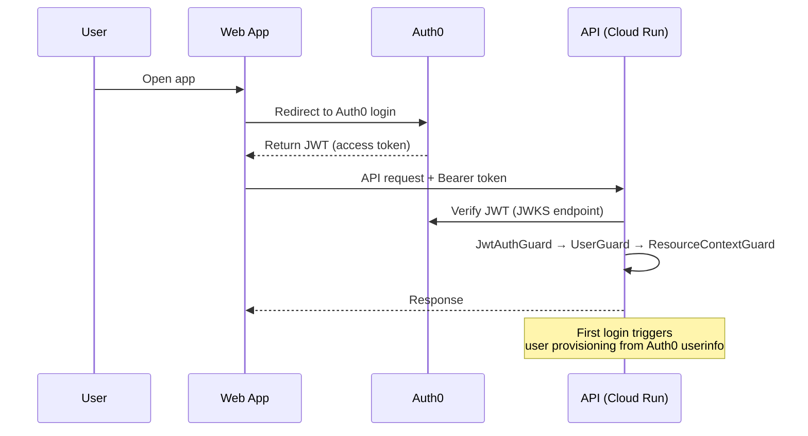
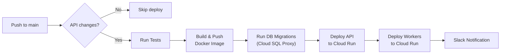

# Agent Builder — Architecture Diagram

## High-Level Architecture

```mermaid
graph TB
    subgraph "Client"
        WEB["Web App (Vite/React)<br/>your-domain.example.com"]
    end

    subgraph "Identity Provider"
        AUTH0["Auth0<br/>your-tenant.auth0.com<br/>JWT / OIDC"]
    end

    subgraph "GitHub"
        GH["GitHub Actions CI/CD<br/>ci.yml / prod.yml"]
    end

    subgraph "Slack"
        SLACK["Slack Webhook<br/>Deploy notifications"]
    end

    subgraph "Google Cloud Platform — europe-west9"

        subgraph "Cloud Run"
            API["API Service (NestJS)<br/>Container: connect<br/>Port 3000<br/>Min: 1 / Max: 1"]
            WORKERS["Workers Service (NestJS)<br/>Cloud Run Workers<br/>Document embeddings"]
        end

        subgraph "Cloud SQL"
            PG["PostgreSQL 17<br/>+ pgvector<br/>Instance: connect-eu"]
        end

        subgraph "Redis"
            REDIS["Redis<br/>BullMQ Job Queue"]
        end

        subgraph "Storage"
            GCS["Google Cloud Storage<br/>Bucket: your-bucket-name"]
        end

        subgraph "Artifact Registry"
            AR["Docker Images<br/>REGION-docker.pkg.dev"]
        end

        subgraph "Secret Manager"
            SM["Secrets<br/>DB password, Redis URL,<br/>Auth0, LangFuse, Slack"]
        end
    end

    subgraph "Google Cloud Platform — europe-west1"
        VERTEX["Vertex AI<br/>Gemini LLM<br/>gemini-embedding-001"]
    end

    subgraph "Observability"
        LANGFUSE["LangFuse<br/>LLM Tracing"]
    end

    %% Client flows
    WEB -- "HTTPS (JWT Bearer)" --> API
    WEB -- "Auth0 SPA SDK<br/>Login / Token" --> AUTH0

    %% API flows
    API -- "TypeORM<br/>Cloud SQL Proxy (Unix Socket)" --> PG
    API -- "BullMQ<br/>Enqueue jobs" --> REDIS
    API -- "GCS SDK<br/>File upload/download" --> GCS
    API -- "AI SDK<br/>LLM inference" --> VERTEX
    API -- "OTEL Exporter" --> LANGFUSE
    API -- "M2M Client Credentials<br/>User provisioning & invitations" --> AUTH0
    API -- "JWKS verification" --> AUTH0

    %% Workers flows
    WORKERS -- "TypeORM" --> PG
    WORKERS -- "BullMQ<br/>Consume jobs" --> REDIS
    WORKERS -- "Embeddings API" --> VERTEX
    WORKERS -- "OTEL Exporter" --> LANGFUSE

    %% CI/CD flows
    GH -- "Build & Push" --> AR
    GH -- "gcloud run deploy" --> API
    GH -- "gcloud run worker-pools deploy" --> WORKERS
    GH -- "migration:run<br/>via Cloud SQL Proxy" --> PG
    GH -- "Deploy notification" --> SLACK

    %% Styling
    classDef gcp fill:#4285F4,stroke:#333,color:#fff
    classDef external fill:#34A853,stroke:#333,color:#fff
    classDef client fill:#FBBC05,stroke:#333,color:#000
    classDef cicd fill:#EA4335,stroke:#333,color:#fff

    class API,WORKERS,PG,REDIS,GCS,AR,SM,VERTEX gcp
    class AUTH0,LANGFUSE,SLACK external
    class WEB client
    class GH cicd
```

## Network Flows Summary

| Source | Destination | Protocol | Purpose |
|--------|-------------|----------|---------|
| Web App | API (Cloud Run) | HTTPS + JWT | All API requests |
| Web App | Auth0 | HTTPS | Login, token refresh (SPA SDK) |
| API | PostgreSQL (Cloud SQL) | Unix Socket (Cloud SQL Proxy) | Data persistence |
| API | Redis | TCP 6379 (TLS in prod) | BullMQ job enqueue |
| API | GCS | HTTPS | File upload/download |
| API | Vertex AI (europe-west1) | HTTPS (gRPC) | LLM inference |
| API | Auth0 | HTTPS | JWKS, M2M provisioning |
| API | LangFuse | HTTPS | LLM observability traces |
| Workers | PostgreSQL | Unix Socket | Read/write entities |
| Workers | Redis | TCP 6379 | BullMQ job consume |
| Workers | Vertex AI | HTTPS (gRPC) | Document embeddings |
| Workers | LangFuse | HTTPS | Observability |
| GitHub Actions | Artifact Registry | HTTPS | Docker image push |
| GitHub Actions | Cloud Run | HTTPS (gcloud) | Service deployment |
| GitHub Actions | Cloud SQL | TCP (proxy) | Run migrations |
| GitHub Actions | Slack | HTTPS (webhook) | Deploy notifications |

## CORS Configuration

Allowed origins on the API:
- `http://localhost:5173` (local dev)
- `https://localhost:5173` (local dev with SSL)
- `https://connect.localhost:5173` (local dev alias)
- `FRONTEND_URL` env var (`https://your-domain.example.com` in production)

## Ports (Local Development)

| Service | Port |
|---------|------|
| API (NestJS) | 3000 |
| Web (Vite) | 5173 |
| PostgreSQL | 5432 |
| Redis | 6379 |
| Cloud SQL Proxy (migrations) | 5433 |

## Authentication Flow

## CI/CD Pipeline (prod.yml)

