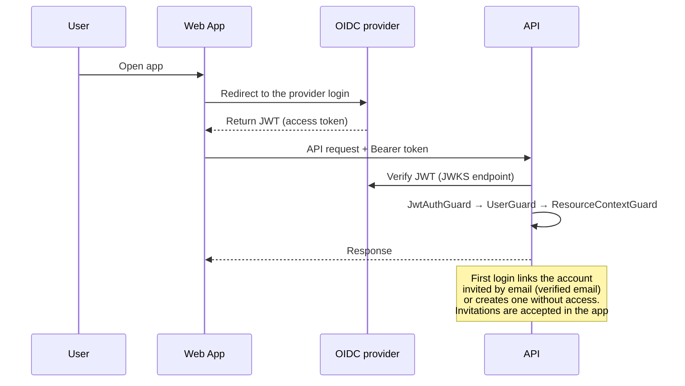
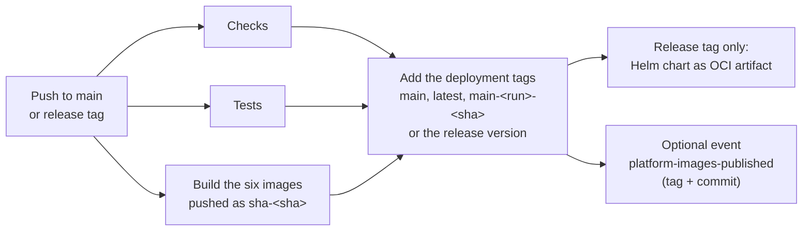

# Agent Builder — Architecture Diagram

## High-Level Architecture

```mermaid
graph TB
    subgraph "Client"
        WEB["Web App (Vite/React)<br/>your-domain.example.com"]
    end

    subgraph "Identity Provider"
        IDP["OpenID Connect provider<br/>Keycloak, Dex, Auth0...<br/>JWT / OIDC"]
    end

    subgraph "GitHub"
        GH["GitHub Actions CI/CD<br/>ci.yml / publish-images.yml"]
        GHCR["GitHub Container Registry<br/>six public images, Helm chart"]
    end

    subgraph "Operator"
        OPS["helm install / upgrade<br/>or any GitOps tool"]
    end

    subgraph "Google Cloud Platform — europe-west9"

        subgraph "Kubernetes (Helm chart)"
            API["API Service (NestJS)<br/>serves the web front<br/>Port 3000"]
            WORKERS["Workers (NestJS)<br/>CPU and GPU<br/>Document embeddings"]
        end

        subgraph "Cloud SQL"
            PG["PostgreSQL 17<br/>+ pgvector<br/>Instance: connect-eu"]
        end

        subgraph "Redis"
            REDIS["Redis<br/>BullMQ Job Queue"]
        end

        subgraph "Storage"
            GCS["Google Cloud Storage<br/>Bucket: your-bucket-name"]
        end

        subgraph "Secret Manager"
            SM["Secrets<br/>DB password, Redis URL,<br/>OIDC client secrets, Slack"]
        end
    end

    subgraph "Google Cloud Platform — europe-west1"
        VERTEX["Vertex AI<br/>Gemini LLM<br/>gemini-embedding-001"]
    end

    subgraph "Observability"
        OTEL["OpenTelemetry gateway<br/>Prometheus, Loki, Phoenix"]
    end

    %% Client flows
    WEB -- "HTTPS (JWT Bearer)" --> API
    WEB -- "oidc-client-ts<br/>Code flow + PKCE" --> IDP

    %% API flows
    API -- "TypeORM<br/>Cloud SQL Proxy (Unix Socket)" --> PG
    API -- "BullMQ<br/>Enqueue jobs" --> REDIS
    API -- "GCS SDK<br/>File upload/download" --> GCS
    API -- "AI SDK<br/>LLM inference" --> VERTEX
    API -- "OTLP" --> OTEL
    API -- "Discovery, JWKS, userinfo" --> IDP

    %% Workers flows
    WORKERS -- "TypeORM" --> PG
    WORKERS -- "BullMQ<br/>Consume jobs" --> REDIS
    WORKERS -- "Embeddings API" --> VERTEX
    WORKERS -- "OTLP" --> OTEL

    %% CI/CD flows
    GH -- "Build & Push" --> GHCR
    OPS -- "chart + values" --> API
    OPS -- "chart + values" --> WORKERS
    OPS -- "migrations<br/>(Helm hook)" --> PG
    API -. "pulls images" .-> GHCR

    %% Styling
    classDef gcp fill:#4285F4,stroke:#333,color:#fff
    classDef external fill:#34A853,stroke:#333,color:#fff
    classDef client fill:#FBBC05,stroke:#333,color:#000
    classDef cicd fill:#EA4335,stroke:#333,color:#fff

    class API,WORKERS,PG,REDIS,GCS,SM,VERTEX gcp
    class IDP,OTEL,OPS external
    class WEB client
    class GH,GHCR cicd
```

## Network Flows Summary

| Source | Destination | Protocol | Purpose |
|--------|-------------|----------|---------|
| Web App | API | HTTPS + JWT | All API requests |
| Web App | OIDC provider | HTTPS | Login, token refresh (authorization code + PKCE) |
| API | PostgreSQL (Cloud SQL) | Unix Socket (Cloud SQL Proxy) | Data persistence |
| API | Redis | TCP 6379 (TLS in prod) | BullMQ job enqueue |
| API | GCS | HTTPS | File upload/download |
| API | Vertex AI (europe-west1) | HTTPS (gRPC) | LLM inference |
| API | OIDC provider | HTTPS | Discovery, JWKS, userinfo |
| API | OpenTelemetry gateway | OTLP/HTTP | Traces and metrics |
| Workers | PostgreSQL | Unix Socket | Read/write entities |
| Workers | Redis | TCP 6379 | BullMQ job consume |
| Workers | Vertex AI | HTTPS (gRPC) | Document embeddings |
| Workers | OpenTelemetry gateway | OTLP/HTTP | Traces and metrics |
| GitHub Actions | GitHub Container Registry | HTTPS | Image and chart push |
| Cluster | GitHub Container Registry | HTTPS | Image and chart pull |

## CORS Configuration

Allowed origins on the API:
- `http://localhost:5173` (local dev)
- `https://localhost:5173` (local dev with SSL)
- `https://connect.localhost:5173` (local dev alias)
- `FRONTEND_URL` env var (`https://your-domain.example.com` in production)

## Ports (Local Development)

| Service | Port |
|---------|------|
| API (NestJS) | 3000 |
| Web (Vite) | 5173 |
| PostgreSQL | 5432 |
| Redis | 6379 |
| Cloud SQL Proxy (migrations) | 5433 |

## Authentication Flow

```mermaid
sequenceDiagram
    participant U as User
    participant W as Web App
    participant A as OIDC provider
    participant API as API

    U->>W: Open app
    W->>A: Redirect to the provider login
    A-->>W: Return JWT (access token)
    W->>API: API request + Bearer token
    API->>A: Verify JWT (JWKS endpoint)
    API->>API: JwtAuthGuard → UserGuard → ResourceContextGuard
    API-->>W: Response
    Note over API: First login links the account<br/>invited by email (verified email)<br/>or creates one without access.<br/>Invitations are accepted in the app
```

## CI/CD Pipeline (publish-images.yml)

```mermaid
flowchart LR
    PUSH["Push to main<br/>or release tag"] --> CHECKS["Checks"]
    PUSH --> TEST["Tests"]
    PUSH --> BUILD["Build the six images<br/>pushed as sha-&lt;sha&gt;"]
    CHECKS --> PUBLISH
    TEST --> PUBLISH
    BUILD --> PUBLISH["Add the deployment tags<br/>main, latest, main-&lt;run&gt;-&lt;sha&gt;<br/>or the release version"]
    PUBLISH --> CHART["Release tag only:<br/>Helm chart as OCI artifact"]
    PUBLISH --> NOTIFY["Optional event<br/>platform-images-published<br/>(tag + commit)"]
```

The images are published only when the checks and the tests pass. What each tag means:

| Tag | Published on | Use |
|---|---|---|
| `sha-<short sha>` | Every build, tests or not | Not for deployments |
| `main-<run>-<short sha>` | Push to `main`, tests passed | Follow `main` at a known build (sortable) |
| `main`, `latest` | Push to `main`, tests passed | Moving tags, for a test install |
| `<version>` (`26.10.2`) | Release tag, tests passed | Production installs |

A release tag also publishes the Helm chart: `oci://ghcr.io/bayesimpact/charts/bayes-platform`, same version without a leading zero in the month (`26.9.1` for `v26.09.1`). Its default image tag is the release version.

Nothing in this repository deploys. To install or upgrade, use the chart with your values: see [deploy/helm/bayes-platform/README.md](../deploy/helm/bayes-platform/README.md). To keep chart and images consistent, take both from the same commit (a release version, or the chart of the commit in `main-<run>-<sha>`).

After the publish, the workflow sends a `repository_dispatch` event `platform-images-published` (tag, commit, repository) to a deployment repository of the organization, so that a GitOps setup can follow new builds. This step needs a GitHub App (`DEPLOY_APP_ID`, `DEPLOY_APP_PRIVATE_KEY`).

### Making a release

1. Check that the `[Unreleased]` part of `CHANGELOG.md` lists the changes (the release fails on an empty one).
2. Tag a commit of `main` whose images are published, with the CalVer version: `git tag v26.10.2 && git push origin v26.10.2`.
3. `release.yml` promotes the changelog (pull request, auto-merged) and creates the GitHub release. `publish-images.yml` publishes the six images and the chart under that version.
4. Upgrade your installs to the new version (`helm upgrade ... --version 26.10.2`, see the chart README).
